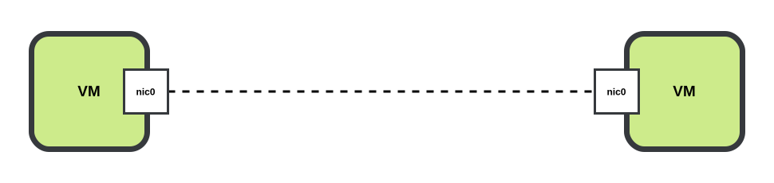

# Point-to-Point

Point to Point links allow for arbitrary connections between
lab nodes. Links are defined in the `manifest.toml`
file int the `links` section.

## P2P Bridge

P2P Bridges are the default P2P link type. They allow for
connectivity between VM's and Containers and also allow
for packet captures via Wireshark or TCPDump.

Node interfaces in a link are assigned to a dedicated linux bridge.
The bridges are connected via a veth pair virtual wire.

!!! Note

    `p2p-bridge` is the only supported link type between
    containers and virtual machines.

## P2P UDP

P2P UDP links are only supported between virtual machines.
`p2p-udp` link interfaces cannot be used as for packet captures.

## P2P vEth

P2P veth links are only supported between containers.
`p2p-veth` link interface can be used for packet captures.

