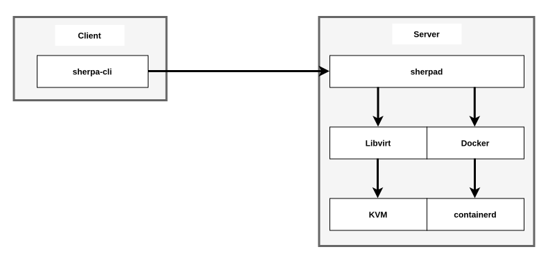

# Overview

Sherpa is a lab management platform for building virtual network topologies using virtual machines, containers, and unikernels. It is designed as a client/server architecture with multiple access methods.

## Client/Server

### Server

The `sherpad` process runs as a systemd service on the host compute server. It manages the full lifecycle of labs, nodes, images, and users. The server exposes three interfaces:

- **WebSocket RPC** — JSON-RPC 2.0 over WebSocket at `wss://<server>:3030/ws`. This is the primary transport used by the `sherpa` CLI.
- **REST API** — Standard HTTP endpoints at `https://<server>:3030/api/v1/`. Supports JSON request/response bodies and Server-Sent Events (SSE) for streaming operations.
- **Web UI** — Browser-based interface at `https://<server>:3030/` built with HTMX. Provides lab management, image management, user administration, and interactive API documentation via Swagger UI at `/api/docs`.

A separate HTTP-only endpoint on port `3031` serves the server's TLS certificate for client trust bootstrapping.

### Client

The `sherpa` client is a CLI utility that connects to the server over WebSocket RPC. It can be installed on Linux, macOS, and Windows. Client configuration and cached files are stored at `~/.sherpa/`.

## Providers

Sherpa supports three node kinds through different virtualisation providers:

| Provider | Technology | Node Kind |
| -------- | ---------- | --------- |
| [Virtual Machine](virtual-machine.md) | KVM/QEMU via Libvirt | Virtual Machine |
| [Container](container.md) | Docker (Bollard API) | Container |
| [Unikernel](unikernel.md) | NanoVMs via Libvirt | Unikernel |

### Virtual Machines

Virtual machines use the KVM hypervisor with the QEMU emulator. Sherpa manages VMs through the Libvirt virtualisation API, which handles domain lifecycle, storage pools, and network interfaces. Each VM is defined as a libvirt domain with configurable CPU, RAM, disk, and network parameters.

### Containers

Containers run on the Docker engine. Sherpa communicates with Docker via the Bollard API library to manage container lifecycle, networking, and volumes. Container images can be pulled from OCI registries or imported from local archives.

### Unikernels

Unikernels from NanoVMs are single-purpose machine images that run directly on KVM/QEMU via Libvirt, similar to virtual machines but with a minimal footprint.

## Database

Sherpa uses [SurrealDB](https://surrealdb.com/) as its embedded database for storing lab state, node configurations, user accounts, and image metadata. The database runs in-process with the server — no external database service is required. See [Database](database.md) for details.

## Authentication

All API access (except login) requires authentication. Sherpa supports two authentication methods:

- **JWT Bearer Token** — obtained via `sherpa login` or the login API endpoint. Tokens are valid for 7 days.
- **Cookie** — `sherpa_token` cookie used by the Web UI.

User accounts have one of two roles: **Basic** (lab operations) or **Admin** (full access including user and image management). A default `sherpa` user is created on first run.

## TLS

TLS is enabled by default. On first startup, the server auto-generates a self-signed certificate if none is configured. Clients can download and trust the server certificate via `sherpa cert trust` or from the HTTP endpoint at `http://<server>:3031/cert`. See [Credentials](credentials.md) for details.

## Networking

Sherpa manages several network types for connecting nodes:

- **Management Network** — connects all nodes to the server for SSH access and ZTP
- **Point-to-Point Links** — direct connections between two nodes
- **Private Bridges** — shared segments visible only within a lab
- **Public Bridges** — connects nodes to existing host bridges for external access
- **Isolated Bridges** — segments with no external connectivity
- **Reserved Bridges** — pre-allocated bridges managed outside of Sherpa

See [Networking](networking/host/bridge.md) for the full networking architecture.

## Zero-Touch Provisioning

Sherpa automatically provisions nodes at boot time using device-appropriate ZTP methods. Supported methods include cloud-init, ZTP scripts, and configuration file injection. See [Zero-Touch Provisioning](zero-touch-provisioning.md) for details.

## Observability

Sherpa supports [OpenTelemetry](https://opentelemetry.io/) for exporting traces and metrics to an OTLP-compatible collector. This is configured in the `[otel]` section of `sherpa.toml`. Server logs are written to `/opt/sherpa/logs/sherpad.log`.

## Storage

Base images, container archives, and unikernel binaries are stored under `/opt/sherpa/`. Each lab gets a dedicated directory with cloned disk images and runtime files. See [Storage](storage.md) for the full directory layout.
